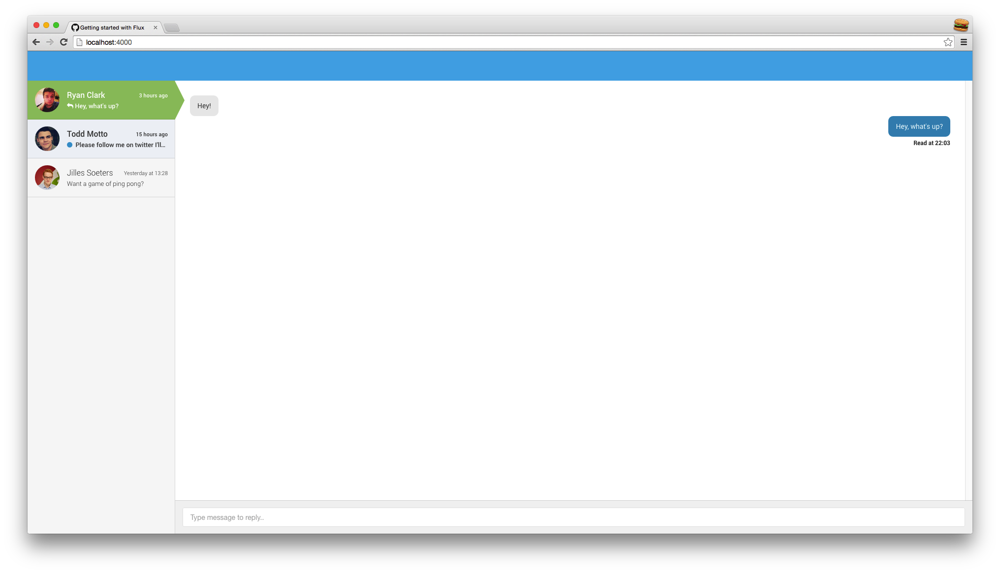
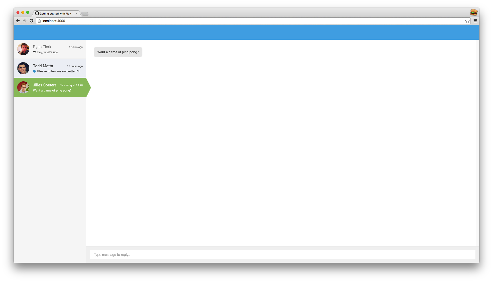
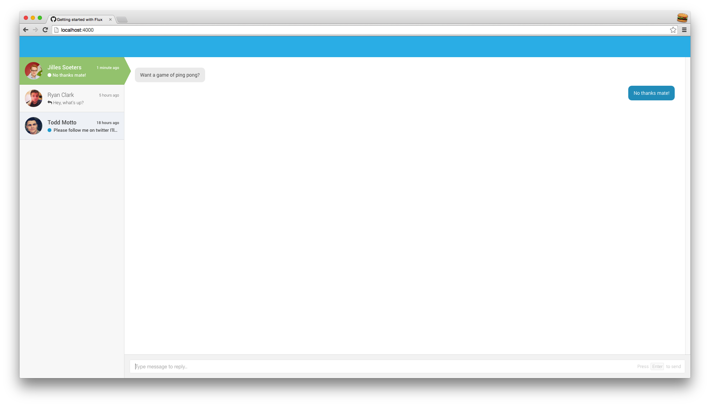
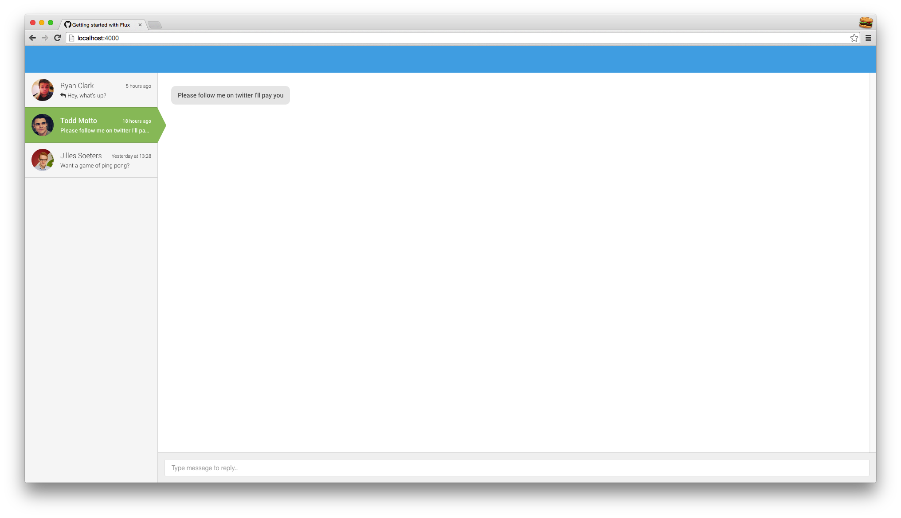
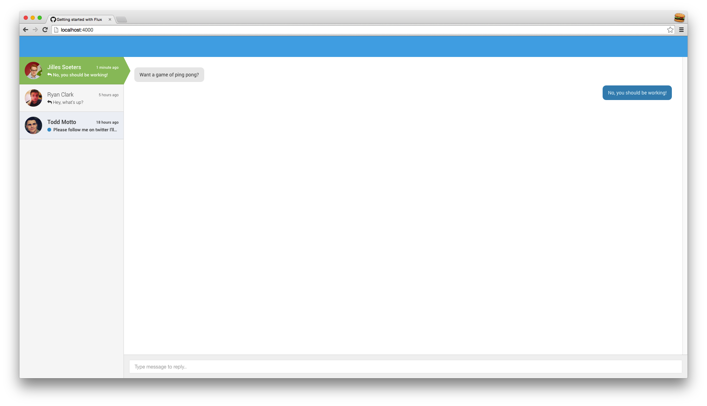

If you're like me and you wanted to go further with React, you more than likely would've checked out <a href="http://facebook.github.io/flux/docs/overview.html#content" target="_blank">Flux</a>, had a glance, closed the tab<!--more--> and then reassessed your life as a Javascript developer.

If you're not familiar with React, please checkout my <a target="_blank" href="/getting-started-with-react">getting started with React</a> post.

## What the Flux?

Flux - from a distance - looks complex to get started with. However, if you look at the <a href="https://github.com/facebook/flux/tree/master/examples" target="_blank">examples over on GitHub</a>, it actually starts to become really clear how it all works.

Flux is, on simple terms, a glorified <a href="http://en.wikipedia.org/wiki/Publish%E2%80%93subscribe_pattern" target="_blank">pub/sub</a> architecture. Data flows one way through the system, and is picked up by various subscribers along the way. One simple way to think about this is to refer to our bodies.

### Events - the blood

Blood travels one way around your body. It gives your organs all the stuff it needs, and picks up more stuff whilst cycling through. All events in Flux travel one way, out of the dispatcher. They may even contain payload data that we need to store.

### Dispatcher - the heart

You only have one heart at any time in your body (most of the time). This is true with the dispatcher, you should only have one per application. The dispatcher purely dispatches events to be listened for - think of it as a central hub.

### Stores - the organs

Our organs take our blood and store what it needs out of it (I was never good at science). which is the same with stores in Flux. Stores wait for events to come, and store the appropriate data that it gives us. Each store can watch for different events, as well as multiple stores watching for the one event.

### Actions - the lungs

This is a bit of a stretch, but much like how our lungs oxygenate our blood and pass it through to the heart to push around, actions allow us to push events into our dispatcher to be broadcasted to the rest of our application.

### View - the body

Once our organs have got all that they need from the blood, they can then do stuff with it. It's the same concept with views - once we've got all the data we need, we can display it!

## Let's chat

Whilst I do apologise for that poor analogy, it does help to simplify what each part of Flux does. We're going to create a simple messaging app (much like one of the Flux examples on GitHub), with multiple components that rely on staying in sync with each other. You can <a href="https://github.com/rynclark/flux-getting-started" target="_blank">clone the start repo here</a>, which includes a gulp task for writing our application. Please note, you don't need to clone the repo - I will link to demos during the tutorial!

### Install

To get started with the boilerplate, you will need to run

```bash
npm install && bower install
```

This will install all of our bower components and node modules, including Flux and React for us to get started with. To run the local web server, run

```bash
gulp
```

And then open up `http://localhost:4000` - simple!

This app uses browserify to build our Javascript files - if you're unfimilar with browserify, head over to <a href="http://www.sitepoint.com/getting-started-browserify/" target="_blank">this tutorial.</a>

Once you've opened up localhost, you should be met with our boilerplate React app!



<a href="/labs/getting-started-with-flux/step-one/" target="_blank">You can view this in your browser here</a> - we're going to build on top of this, using Flux to keep our model and view in sync.

### Views

We've got two main views, named `UserList` and `MessageBox`. Not only does the main message box need to display the chat for which user is selected in the list, they both rely on the same data in order to display the messages, and one view becoming out of sync with the other could become disastrous. This is where the magic of Flux comes in!

### Dispatcher, come in

As mentioned earlier, every application needs one dispatcher - let's go ahead and create it. The app has a folder inside `public/src/js/` called `dispatchers` - we're going to create a new file inside this directory called `app.js`. As we're using browserify we can require the flux npm module straight into our code.

```js
var assign = require('object-assign');

var appDispatcher = assign(new Dispatcher(), {
  handleServerAction: function (action) {
    this.dispatch({
      source: 'server',
      action: action
    })
  },
  handleViewAction: function (action) {
    this.dispatch({
      source: 'view',
      action: action
    });
  }
});

module.exports = appDispatcher;
```

We've now created the dispatcher, and added two action types to it. This allows us to receive actions from both the view (the user accessing the application) and the server (more on that soon). You'll notice in both methods we are calling `this.dispatch` - this dispatches the given payload (containing `source` and `action`) to anyone who is watching!.

### Store our messages

Our views need somewhere to get their data from, so let's create a store for our messages. The boilerplate has a folder in `public/src/js` called `stores`, which already contains `user.js` (just a basic store of information, this would typically be received via a server), so we'll go ahead and create a file called `messages.js`.

For now, we're going to be using static default data. Typically this would come from the server beforehand, but we haven't integrated ours with a server (yet..).

```js
var EventEmitter = require('events').EventEmitter;
var assign = require('object-assign');

var messages = {
  2: {
    user: {
      profilePicture: 'https://avatars0.githubusercontent.com/u/7922109?v=3&s=460',
      id: 2,
      name: 'Ryan Clark',
      status: 'online'
    },
    lastAccess: {
      recipient: 1424469794050,
      currentUser: 1424469794080
    },
    messages: [
      {
        contents: 'Hey!',
        from: 2,
        timestamp: 1424469793023
      },
      {
        contents: 'Hey, what\'s up?',
        from: 1,
        timestamp: 1424469794000
      }
    ]
  },
  ...
};

var openChatID = parseInt(Object.keys(messages)[0], 10);

var messagesStore = assign({}, EventEmitter.prototype, {
  addChangeListener: function (callback) {
    this.on('change', callback);
  },
  removeChangeListener: function (callback) {
    this.off('change', callback);
  },
  getOpenChatUserID: function () {
    return openChatID;
  },
  getChatByUserID: function (id) {
    return messages[id];
  },
  getAll: function () {
    return messages;
  }
});

messagesStore.dispatchToken = Dispatcher.register(function (payload) {

});
```

##### Payload Explanation
We're using an object for our messages, with the user's ID as the key, and various data about the user in value. If you open up both `messageBox.jsx` and `userList.jsx` in `public/src/js/partials/`, you'll notice the static data in the store is pretty much exactly the same as what we're already rendering our React view with. This means that it is going to be super easy to get our view hooked up to the store.

If you're wondering what `lastAccess` is, it basically has two values, one for the current user who is accessing the application and one for the other user. They're UNIX timestamps of when they last accessed the chat, so we can tell if the messsages are either unread or read.

We've also got `openChatID` - this is the value of the first key of our messages (the first user ID), so the first chat is open by default.

##### Store Explanation
To create our store, we're extending upon a default node module called `events`. As mentioned above, we're using browserify so we can just include this right in. This allows us to quickly make objects that let us register and unregister callbacks, as well as emit events.

I've added on both `addChangeListener` and `removeChangeListener` to our store - this is just a more verbose method of `on` and `off`, so you can tell exactly what it's doing. I've also added two methods to retrieve message data, either all of it or by user ID. We can use these two functions in both of our views, to get the relevant data we need.

There's also the store's `dispatchToken` - this is all the events that it listens to from our dispatcher. At the moment we're not concerned about any events, so it is just a blank object.

### Hook it all up

Now we can make our views get their data from the same place, our store. If we go into our `MessageBox` view in `public/src/js/partials`, you can see that we're setting the state to contain the message data for the currently open chat. As this is in our store, accessible via `getChatByUserID` (and to get the current user ID, `getOpenChatUserID`), we can remove it and replace it with calls to our store.

```jsx
var UserStore = require('../stores/user');

var Utils = require('../utils');

var MessageBox = React.createClass({
  getInitialState: function () {
    return {
      user: ...,
      lastAccess: ...,
      messages: [...]
    };
  },
  render: function () {
    // ommited logic

    return (
      <div className="message-box">
        <ul className="message-box__list">
          { messages }
        </ul>
        <ReplyBox />
      </div>
    );
  }
});

module.exports = MessageBox;
```

Will become -

```jsx
var MessagesStore = require('../stores/messages');
var UserStore = require('../stores/user');

var Utils = require('../utils');

var MessageBox = React.createClass({
  getInitialState: function () {
    return MessagesStore.getChatByUserID(MessagesStore.getOpenChatUserID());
  },
  render: function () {
    // ommited logic

    return (
      <div className="message-box">
        <ul className="message-box__list">
          { messages }
        </ul>
        <ReplyBox />
      </div>
    );
  }
});

module.exports = MessageBox;
```

Once you've made that change, look at your localhost - it looks exactly the same! Perhaps the only time you should be happy that a major code change produced no visual change in your UI, but nonetheless we're one step closer!

Now we can do the same to our `UserList`. This will require a bit of pre-processing our stored data, as we're only interested in the last message sent. If we open up `userList.jsx` in `public/src/js/partials`, we will see what data we're using -

```jsx
var UserStore = require('../stores/user');

var UserList = React.createClass({
  getInitialState: function () {
    return {
      openChatID: 0,
      messageList: [
        {
          lastMessage: {
            contents: 'Hey, what\'s up?',
            from: 1,
            timestamp: 1424469794000
          },
          lastAccess: {
            recipient: 1424469794050,
            currentUser: 1424469794080
          },
          user: {
            profilePicture: 'https://avatars0.githubusercontent.com/u/7922109?v=3&s=460',
            id: 2,
            name: 'Ryan Clark',
            status: 'online'
          }
        },
        ...
      ]
    }
  },
  render: function () {
    // omitted logic

    return (
      <div className="user-list">
        <ul className="user-list__list">
          { messages }
        </ul>
      </div>
    );
  }
});

module.exports = UserList;
```

As the data we need isn't that far away from our stored data, processing it to what we need will be relatively easy.

```jsx
var MessagesStore = require('../stores/messages');
var UserStore = require('../stores/user');

var UserList = React.createClass({
  getInitialState: function () {
    var allMessages = MessagesStore.getAllChats();

    var messageList = [];
    for (var id in allMessages) {
      var item = allMessages[id];

      var messagesLength = item.messages.length;
      messageList.push({
        lastMessage: item.messages[messagesLength -1],
        lastAccess: item.lastAccess,
        user: item.user
      })
    }

    return {
      openChatID: MessagesStore.getOpenChatUserID(),
      messageList: messageList
    };
  },
  render: function () {
    // omitted logic

    return (
      <div className="user-list">
        <ul className="user-list__list">
          { messages }
        </ul>
      </div>
    );
  }
});

module.exports = UserList;
```

How simple was that!? And we still get exactly the same results as we did before we changed, but it comes from a single source now!

<a href="/labs/getting-started-with-flux/step-two/" target="_blank">You can this out so far here</a> - I've omitted the screenshot as nothing has changed but our underlying code. You can also check out all the code by checking out the `step-two` branch on our boilerplate.

### Get some blood (events) flowing

The next step is to get some events flowing around our app. Let's get it so we can swap between our chats by clicking on different users on the `UserList`.

#### Our first Action

Actions can come from anywhere, all we need to know is that they affect something and we need to funnel them through our dispatcher and out into our stores. We'll create an action when the user clicks on a user, and dispatch the event.

In `public/src/js` there is a folder called `actions` - let's create a file called `messages.js` -

```js
var messagesActions = {
  changeOpenChat: function (newUserID) {
    Dispatcher.handleViewAction({
      type: 'updateOpenChatID',
      userID: newUserID
    });
  }
};

module.exports = messagesActions;
```

Actions are nothing special. No npm module or other dependency is needed, all we need is our already created dispatcher. We can now call `changeOpenChat` with an ID, and it will dispatch an action to our stores. But wait - our stores need to listen to them!

#### Watching for an event in a store

We're going to open up our `MessagesStore` again, and have a look at our `dispatchToken`. This function is invoked whenever the dispatcher receives an action to dispatch. We can then check if the payload dispatched concerns us, and do some fancy stuff if it does.

```js
  var actions = {
    updateOpenChatID: function (payload) {

    }
  };

  actions[payload.action.type] && actions[payload.action.type](payload);
});
```

I've added an object with the key being the `type` property value of the event we dispatched in our actions. The function checks to see if there is a property that matches the type it's given, and invokes it if it is. Within this function we can now update our store values, and notify our views that something has changed.

```js
  var actions = {
    updateOpenChatID: function (payload) {
      openChatID = payload.action.userID;

      messagesStore.emit('change');
    }
  };

  actions[payload.action.type] && actions[payload.action.type](payload);
});
```

We've now updated our `openChatID` variable with the new ID, and then we've emitted a change on our store. (Note: the `emit` method is given to us by `EventEmitter`).

That's great, but our views won't have a clue anything has been updated, as they haven't subscribed to any events.

#### Views, listen up

We're going to add a listener to our view, and update the state whenever we get a notification that something has changed. If we open up `MessageBox`, we can add a `componentWillMount` and `componentWillUnmount` method to them. This is so we can add the event whenever the view is created, and if for some reason it's deleted, remove the event so we don't get any future errors.

```js
var MessagesStore = require('../stores/messages');
var UserStore = require('../stores/user');

var Utils = require('../utils');

function getStateFromStore() {
  return MessagesStore.getChatByUserID(MessagesStore.getOpenChatUserID())
}

var MessageBox = React.createClass({
  getInitialState: function () {
    return getStateFromStore();
  },
  componentWillMount: function () {
    MessagesStore.addChangeListener(this.onStoreChange);
  },
  componentWillUnmount: function () {
    MessagesStore.removeChangeListener(this.onStoreChange);
  },
  onStoreChange: function () {
    this.setState(getStateFromStore());
  },
  render: function () {
    // omitted logic
  }
});

module.exports = MessageBox;
```

You'll notice we've got a new function `getStateFromStore` - I've abstracted the call to get the state so we can reuse it multiple times. That way, if we ever need to change how we get our state, we won't have to make the change in multiple places.

When the component mounts, we've added a change listener, which will fire off the `onStoreChange` method, updating our view to the latest data in the store. When the component unmounts, we clean up after ourselves and remove the listener.

##### And again...

Now we need to do the same to the `UserList`. We could just update the state manually for the `UserList` view, however the best practise is to rely on the data from the store, as it will be the same for all of our views that request it.

Let's open up `UserList`, abstract the state retrieval and add our listeners.

```js
var MessagesStore = require('../stores/messages');
var UserStore = require('../stores/user');

var UserList = React.createClass({
  getInitialState: function () {
    var allMessages = MessagesStore.getAllChats();

    var messageList = [];
    for (var id in allMessages) {
      var item = allMessages[id];

      var messagesLength = item.messages.length;
      messageList.push({
        lastMessage: item.messages[messagesLength -1],
        lastAccess: item.lastAccess,
        user: item.user
      })
    }

    return {
      openChatID: MessagesStore.getOpenChatUserID(),
      messageList: messageList
    };
  },
  render: function () {
    // omitted logic
  }
});

module.exports = UserList;
```

Will become -

```js
var MessagesStore = require('../stores/messages');
var UserStore = require('../stores/user');

function getStateFromStore() {
  var allMessages = MessagesStore.getAllChats();

  var messageList = [];
  for (var id in allMessages) {
    var item = allMessages[id];

    var messagesLength = item.messages.length;
    messageList.push({
      lastMessage: item.messages[messagesLength -1],
      lastAccess: item.lastAccess,
      user: item.user
    })
  }

  return {
    openChatID: MessagesStore.getOpenChatUserID(),
    messageList: messageList
  };
}

var UserList = React.createClass({
  getInitialState: function () {
    return getStateFromStore();
  },
  componentWillMount: function () {
    MessagesStore.addChangeListener(this.onStoreChange);
  },
  componentWillUnmount: function () {
    MessagesStore.removeChangeListener(this.onStoreChange);
  },
  onStoreChange: function () {
    this.setState(getStateFromStore());
  },
  render: function () {
    // omitted logic
  }
});

module.exports = UserList;
```

Sorted! Our `UserList` will now listen for events too.

#### Firing off the event

Now we've got our view ready to listen to the event, we need to actually set it off. We will do this in the `UserList` view when the user clicks on a different user. To start off, we're going to open up `UserList` and add an onClick listener.

```jsx
var MessagesStore = require('../stores/messages');
var UserStore = require('../stores/user');

var UserList = React.createClass({
  ...,
  changeOpenChat: function (id) {
  },
  render: function () {
    // omitted logic

    var messages = this.state.messageList.map(function (message, index) {
      // omitted logic

      return (
        <li onClick={ this.changeOpenChat.bind(this, message.user.id) } className={ itemClasses } key={ message.user.id }>
          <div className="user-list__item__picture">
            
          </div>
          <div className="user-list__item__details">
            <h4 className="user-list__item__name">
              { message.user.name }

              <abbr className="user-list__item__timestamp">
                { date }
              </abbr>
            </h4>
            <span className="user-list__item__message">
              { statusIcon } { message.lastMessage.contents }
            </span>
          </div>
        </li>
      )
    }, this);

    // omitted logic
  }
});

module.exports = UserList;
```

We've now got an `onClick` event that will call our method `changeOpenChat` with the user ID of whoever the user clicked. We can now invoke the action that we created earlier.

```js
var MessagesStore = require('../stores/messages');
var UserStore = require('../stores/user');

var MessagesActions = require('../actions/messages');

var UserList = React.createClass({
  ...,
  changeOpenChat: function (id) {
    MessagesActions.changeOpenChat(id);
  },
  render: function () {
    // omitted logic
  }
});

module.exports = UserList;
```

Pretty nice, eh? We've set it up so all we need to do is call an action we defined with an ID, that takes care of sending off the event to the dispatcher, that our stores then listen to, then notify the view that they've updated! And it really is as simple as that. If you click on a different user, you can now see their messages -



<a href="/labs/getting-started-with-flux/step-three/" target="_blank">You can play around with this here.</a> You can also checkout the `step-three` branch on the boilerplate if you wish to see all the code!

### Send a message

The next logical step is that we need to be able to send some messages! You're going to love how simple this is going to be. First of all, we need to create an event on our input box for when the user presses enter. Let's go!

#### Create the event

We've got a component called `ReplyBox` in `public/src/js/components`. Open it up - you'll find a bare boned React component in there. First of all, we need to keep track of the input's value in the components state. Let's add an `onChange` event to our input. As we're also tracking state in this component, we will need to add a `getInitialState` method to return our initial state.

```jsx
  getInitialState: function () {
    return {
      value: ''
    };
  },
  updateValue: function (e) {

  },
  render: function () {
    return (
      <div className="reply-box">
        <input onChange={ this.updateValue } className="reply-box__input" placeholder="Type message to reply.." />
        <span className="reply-box__tip">
          Press <span className="reply-box__tip__button">Enter</span> to send
        </span>
      </div>
    );
  }
});

module.exports = ReplyBox;
```

React passes through an event to your functions when they're called from user input. We can access what the user is typing by looking at `e.target.value`. Then all we need to do is set the state to this, set the input's value to the state, and we're sorted! <a href="http://facebook.github.io/react/docs/events.html" target="_blank">Read more about React events here</a>.

```jsx
  getInitialState: function () {
    return {
      value: ''
    };
  },
  updateValue: function (e) {
    this.setState({
      value: e.target.value
    });
  },
  render: function () {
    return (
      <div className="reply-box">
        <input value={ this.state.value } onChange={ this.updateValue } className="reply-box__input" placeholder="Type message to reply.." />
        <span className="reply-box__tip">
          Press <span className="reply-box__tip__button">Enter</span> to send
        </span>
      </div>
    );
  }
});

module.exports = ReplyBox;
```

Beautiful! Now we can access whatever has been typed in the reply box in the `state` object of the component. If we add an `onKeyDown` event to the input also, we can now check the `keyCode` of the event. If it is 13 (the Javascript key code for enter), we can submit and clear out the value of the input.

```jsx
var MessagesStore = require('../stores/messages');

var ReplyBox = React.createClass({
  getInitialState: function () {
    return {
      value: ''
    };
  },
  handleKeyDown: function(e) {
    if (e.keyCode === 13) {
      MessagesActions.sendMessage(MessagesStore.getOpenChatUserID(), this.state.value);

      this.setState({
        value: ''
      });
    }
  },
  updateValue: function (e) {
    this.setState({
      value: e.target.value
    });
  },
  render: function () {
    return (
      <div className="reply-box">
        <input value={ this.state.value } onKeyDown={ this.handleKeyDown } onChange={ this.updateValue } className="reply-box__input" placeholder="Type message to reply.." />
        <span className="reply-box__tip">
          Press <span className="reply-box__tip__button">Enter</span> to send
        </span>
      </div>
    );
  }
});

module.exports = ReplyBox;
```

We've added a check for that key code, and if it is enter, we're calling `sendMessages` in `MessagesActions` with the value of the message we want to send. But wait, that action doesn't exist yet!?

#### Create the action

Let's add a new action to our `MessagesActions` object. This will accept message text and the user ID that we are sending a message to. It will then dispatch an event for the stores to listen to. Normally, this would be the point where you'd contact the server with the message, and then dispatch the event once the server has responded that it's all okay.

```js
var messagesActions = {
  changeOpenChat: function (newUserID) {
    Dispatcher.handleViewAction({
      type: 'updateOpenChatID',
      userID: newUserID
    });
  },
  sendMessage: function (userID, message) {
    Dispatcher.handleViewAction({
      type: 'sendMessage',
      userID: userID,
      message: message,
      timestamp: +new Date()
    });
  }
};

module.exports = messagesActions;
```

Now we've made the action, we can type in the reply box and press enter and check that it empties. The store isn't watching for the event just yet, so it will just clear out the input and do nothing after. Let's set the store up to watch for a new message.

#### Create the store watcher

Heading back to our `dispatchToken` in our `MessagesStore`, we can now add another item to our object - `sendMessage`. We get the user ID to send to, the timestamp it was sent and the contents of the message.

Let's look up the user who we've sent a message to in our `messages` object, and push a new message into their messages array.

```js
  var actions = {
    updateOpenChatID: function (payload) {
      openChatID = payload.action.userID;

      messagesStore.emit('change');
    },
    sendMessage: function (payload) {
      var userID = payload.action.userID;

      messages[userID].messages.push({
        contents: payload.action.message,
        timestamp: payload.action.timestamp,
        from: UserStore.user.id
      });

      messagesStore.emit('change');
    }
  };

  actions[payload.action.type] && actions[payload.action.type](payload);
});
```

Sorted. If you look at localhost now, you can type in the reply box, press enter and the message appears not only in the `MessageBox` view, but also in the `UserList` view as the last sent message.

If you send a message to myself, you'll also notice the "Read" message disappears - that's because we're keeping track of the last time I accessed the chat (via `lastAccess`), and I haven't accessed it since you've sent me a message!

Also, if you send a message to either Todd or Jilles, they'll move to the top of the list, as they're ordered by when the last message was sent!



<a href="/labs/getting-started-with-flux/step-four/" target="_blank">Send some imaginary people messages here</a>, or you can checkout the `step-four` branch to see the code!

#### Updating our last access

We haven't got any method to update our `lastAccess` status, meaning that any messages you sent will have a circle next to them on the `UserList` view.

In our store, we can simply update this when the user triggers a method.

```js
  var actions = {
    updateOpenChatID: function (payload) {
      openChatID = payload.action.userID;
      messages[openChatID].lastAccess.currentUser = +new Date();

      messagesStore.emit('change');
    },
    sendMessage: function (payload) {
      var userID = payload.action.userID;

      messages[userID].messages.push({
        contents: payload.action.message,
        timestamp: payload.action.timestamp,
        from: UserStore.user.id
      });
      messages[userID].lastAccess.currentUser = +new Date();

      messagesStore.emit('change');
    }
  };

  actions[payload.action.type] && actions[payload.action.type](payload);
});
```

We've added calls to update the `lastAccess` value on both `updateOpenChatID` (as the user has just opened the chat) and `sendMessage` (as the user has just sent the message).

Now, when you click on a user with an unread message (such as Todd), it will mark it as read! Or if you reply to Jilles, you will get the neat reply icon in the `UserList` view.





<a href="/labs/getting-started-with-flux/step-five/" target="_blank">Play around with the finished chat application here</a>, or you can checkout the `step-five` branch to see the code!

### waitFor

Flux also offers you the ability to wait for other stores to finish processing their data before executing the `dispatchToken` on your store. To do this, at the beginning of your store, just call the dispatchers `waitFor` function at the beginning of your `dispatchToken` function, passing through an array of stores that you wish to wait for.

```js
Store.dispatchToken = Dispatcher.register(function (payload) {
  Dispatcher.waitFor([
    OtherStore.dispatchToken,
    AndAnotherStore.dispatchToken
  ]);
});
```
## Conclusion

In conclusion, although Flux seems scary to get started with, it is in fact ridiculously simple and quick to develop with. Just follow the steps above when using it in your applications! If you need any help, feel free to reach out to me on twitter - <a href="http://twitter.com/rynclark" target="_blank">@rynclark</a>. I'll be looking into integrating this with node.js and socket.io in the future, so stay tuned.
