As a JavaScript developer, I would've never thought that I could make **native** mobile applications easily in JavaScript<!--more-->. Sure, we have tools such as PhoneGap, but wrapping our browser based application in native application leaves a lot to be desired.

It's all changed now - the React team over at Facebook have released React Native. This not only allows us to use the React framework to create applications that utilise native mobile components, but it does that all in real time - meaning that we don't have to recompile our applications as we develop on them - this makes it incredibly easy to create mobile apps! Luckily I got to preview React Native in its beta and even since then it's progressed massively.

Please note that currently iOS is supported. You will therefore need to be running OS X with XCode in order to follow this tutorial.

If you haven't had a chance to learn React, <a target="_blank" href="/getting-started-with-react">take a look at my tutorial</a> to get started with it.

It's important to note that this doesn't mean we can write code once and use it everywhere. Trying to do that can be disastrous as the level of abstraction would be insane. Instead, React Native allows us to learn once, write everywhere.

## Going back to 2004

If you have watched The Social Network you will remember FaceMash, the application that kicked off Facebook. For those who haven't watched, 11 years ago (wow) Mark Zuckerberg created FaceMash, an application where you could view two people and rate which one is hotter. Each person would have a score (although the original algorithm is unknown, the movie shows the <a href="http://en.wikipedia.org/wiki/Elo_rating_system" target="_blank">Elo rating algorithm</a> being used) that reflected how "hot" they are.

Here it is in all it's glory -


Let's go full circle - we're going to be recreating FaceMash in React Native. If you think it's immoral to rate girls on their looks, feel free to change the pictures to something else that you find attractive (dogs, snippets of code, etc, I'm not judging you).

## Creating our app

<a href="https://github.com/ryanclark/facemash" target="_blank">You can clone the start repo here</a> if you wish. This isn't necessary, however there different branches of the code at different stages just in case you get lost!

### Houston, we have lift off

If you haven't cloned the repo, we need to setup our base project. React Native allows us to quickly start up a project with the `react-native-cli` npm package CLI. If you don't have it installed, quickly run

```bash
npm install -g react-native-cli
```

And then we can get started.

Navigate to a folder in the terminal and run

```bash
react-native init FaceMash
```

This will create our base application ready for us to dig in and add to.

### Open it up

Launch XCode and navigate to the directory you created the application in. From here, we will need to open up `facemash.xcodeproj`.

React Native supports us working in both the iOS Simulator and our actual iOS devices.

I will be developing in the iOS Simulator as it allows more rapid application development - we can press `Command + R` to refresh the application when we make changes to our JavaScript, or we can be super lazy and enable live reloading via the developer menu (accessible via `Command + Control + Z`). We can even debug our code in the Chrome developer tools.

If you wish to develop the application using your iOS device, you will need to be on the same network as your computer. By default, React Native will look at `localhost` for the JavaScript so you will need to point it to your computer.

We can do this by editing the `AppDelegate.m` file and changing `localhost` to our local IP. You can find this on OS X by `Alt + Click`-ing the wireless menu.

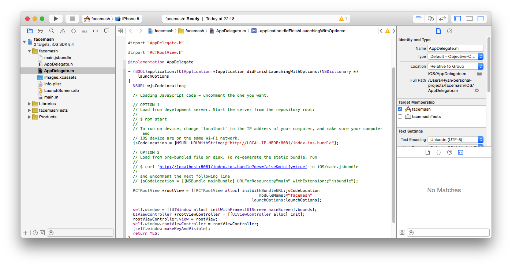

We can now run our application. The application will open in whatever target you've picked in XCode. When we click run, a terminal process will also spawn running `npm start` in the directory of our application. If you don't wish to run the app through XCode, make sure you run `npm start`. This will create a local web server on port `8081` which points to our compiled JavaScript code and also watch and recompile our code on save.

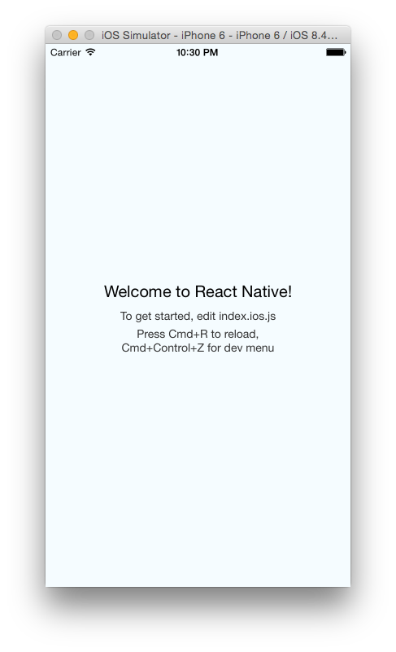

I'm running the application in a simulated iPhone 6, running at a 50% scale.

There we go, we've got a blank canvas with so much room for activities!

## Taking a peek

Let's take a look at the code it takes to render what we can see in the screenshot above. Open up `index.ios.js`.

```jsx
/**
 * Sample React Native App
 * https://github.com/facebook/react-native
 */
'use strict';

var React = require('react-native');
var {
  AppRegistry,
  StyleSheet,
  Text,
  View,
} = React;

var facemash = React.createClass({
  render: function() {
    return (
      <View style={styles.container}>
        <Text style={styles.welcome}>
          Welcome to React Native!
        </Text>
        <Text style={styles.instructions}>
          To get started, edit index.ios.js
        </Text>
        <Text style={styles.instructions}>
          Press Cmd+R to reload,{'\n'}
          Cmd+Control+Z for dev menu
        </Text>
      </View>
    );
  }
});

var styles = StyleSheet.create({
  container: {
    flex: 1,
    justifyContent: 'center',
    alignItems: 'center',
    backgroundColor: '#F5FCFF',
  },
  welcome: {
    fontSize: 20,
    textAlign: 'center',
    margin: 10,
  },
  instructions: {
    textAlign: 'center',
    color: '#333333',
    marginBottom: 5,
  },
});

AppRegistry.registerComponent('facemash', () => facemash);
```

You can close your mouth now - yes, that is all it takes to render our application. Looks familiar, doesn't it?

## React Native vs the browser

Not all of React Native matches what you would've been using with React in the browser. However, the differences between the two are so minuscule there's no need to worry about them.

- Instead of using block elements such as `div` or `section`, we use the `View` component in React Native. This maps over to the native iOS component `UIView`.
- All text must be wrapped inside the `Text` component
- No stylesheets - all your styling is written as JavaScript objects
- We don't need to worry about what is browser compatibility - ES6 harmony is supported out of the box as well as flexbox

## Get to work

We're going to start by clearing out the stylesheet and `render` function of our React component. Ideally, to get a basic feeling of React Native, we're going to try and use as many different components as we can.

Let's start off with the `TabBarIOS` component. You might recognise the TabBar component, used in some of the core iOS apps such as Clock and Photos.

```jsx
var React = require('react-native');
var {
  AppRegistry,
  StyleSheet,
  Text,
  View,
  TabBarIOS
} = React;

var facemash = React.createClass({
  getInitialState() {
    return {
      selectedTab: 'faceMash'
    }
  },
  render: function() {
    return (
      <TabBarIOS>
        <TabBarIOS.Item
          title="FaceMash"
          icon={ require('image!facemash') }
          selected={ this.state.selectedTab === 'faceMash' }>
          <View style={ styles.pageView }>
            <Text>Face Mash</Text>
          </View>
        </TabBarIOS.Item>
        <TabBarIOS.Item
          title="Messages"
          icon={ require('image!messages') }
          selected={ this.state.selectedTab === 'messages' }>
          <View style={ styles.pageView }>
            <Text>Messages</Text>
          </View>
        </TabBarIOS.Item>
        <TabBarIOS.Item
          title="Settings"
          icon={ require('image!settings') }
          selected={ this.state.selectedTab === 'settings' }>
          <View style={ styles.pageView }>
            <Text>Settings</Text>
          </View>
        </TabBarIOS.Item>
      </TabBarIOS>
    );
  }
});

var styles = StyleSheet.create({
  pageView: {
    backgroundColor: '#fff',
    flex: 1
  }
});

// omitted code
```

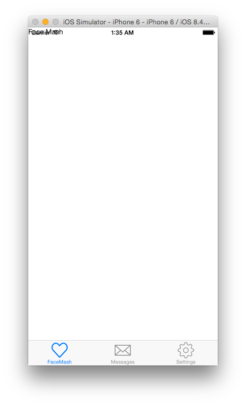

Look at that! You'll notice that the text is currently over the status bar, but don't worry, we'll fix that later on.

The `TabBarIOS` component uses `TabBarIOS.Item` for each of its children. We're going to have three pages - the page where you rate people, a messages list and a settings page.

The `TabBarIOS.Item` must have one child. This will be the contents of the page that has been selected (you can see us setting selected to true/false depending on the state of the component).

Obviously, a tab bar wouldn't look good without icons. There are a few system icons you can use, however if you use them the text of the tab also changes to match the icon. Instead, we can use our own icons. To import a local image asset in React Native, you can use `require` and prepend the asset name with `image!`.

I'm using icons that are available free, under the CC 3.0 licence, from <a href="http://www.flaticon.com/" target="_blank">flaticon</a>.

#### Using Static Images

To add a static image for React Native, open up XCode. In the Project Navigator (the first icon on the left hand pane), open up `Images.xcassets`. All your images will sit here.

This allows us to keep all our assets under one name, whilst providing different images for both each resolution, and even device specific images.

Images must follow a strict naming convention. Use the asset name (such as `messages` or `settings`) and append it with the resolution it should be displayed at. For instance, I'm building my application for an iPhone 6 so I would use the `@2x` resolution.

Once you've named your image file correctly, drag and drop it into the left hand page in `Images.xcassets`.

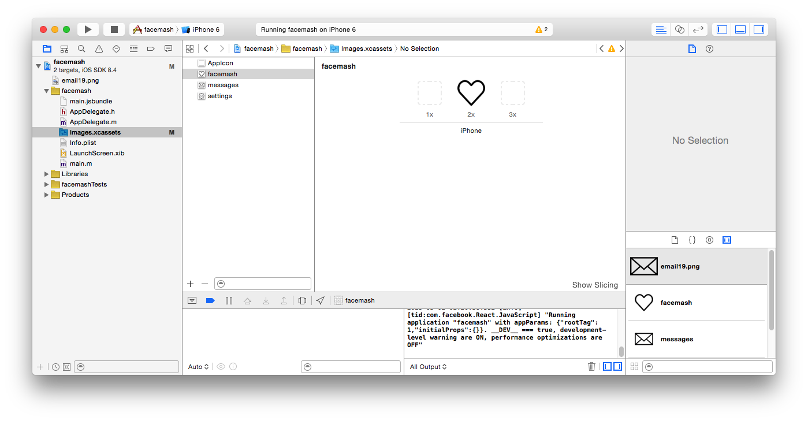

You can then use `require('image!assetname')` in React Native!

#### Back to the code

The next logical step is to set up our main component to allow switching between tabs. We can do this by just setting the state when the user clicks on it. `TabBarIOS.Item` allows us to give it an `onPress` property, which we can use to detect when a user taps on the tab.

```jsx
// omitted code

var facemash = React.createClass({
  getInitialState() {
    return {
      selectedTab: 'faceMash'
    }
  },
  changeTab(tabName) {
    this.setState({
      selectedTab: tabName
    });
  },
  render: function() {
    return (
      <TabBarIOS>
        <TabBarIOS.Item
          title="FaceMash"
          icon={ require('image!facemash') }
          onPress={ () => this.changeTab('faceMash') }
          selected={ this.state.selectedTab === 'faceMash' }>
          <View style={ styles.pageView }>
            <Text>Face Mash</Text>
          </View>
        </TabBarIOS.Item>
        <TabBarIOS.Item
          title="Messages"
          icon={ require('image!messages') }
          onPress={ () => this.changeTab('messages') }
          selected={ this.state.selectedTab === 'messages' }>
          <View style={ styles.pageView }>
            <Text>Messages</Text>
          </View>
        </TabBarIOS.Item>
        <TabBarIOS.Item
          title="Settings"
          icon={ require('image!settings') }
          onPress={ () => this.changeTab('settings') }
          selected={ this.state.selectedTab === 'settings' }>
          <View style={ styles.pageView }>
            <Text>Settings</Text>
          </View>
        </TabBarIOS.Item>
      </TabBarIOS>
    );
  }
});

// omitted code
```

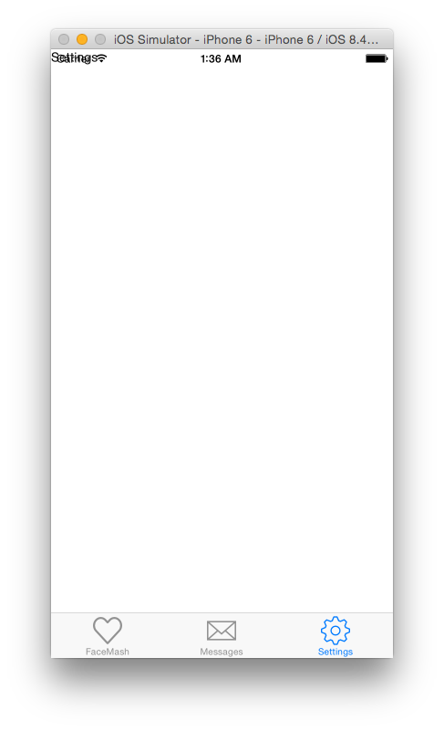

Done! It's that simple. Refresh your app by pressing `Command + R` in the iOS simulator (or recompile it via XCode if you're developing on your device) and you'll notice we can now tap between tabs, and the screen changes!

Although we haven't written much code, you can check out the `step-one` branch, which also contains all the icons we've used for the tabs.

## Let's Mash

Let's work on the FaceMash tab. We're going to hit an endpoint to load our data using `fetch`. In the `step-one` branch, I've included a `config.yaml` file in the `rest/` folder that we're going to use to mock our endpoints using <a href="http://stub.by/" target="_blank">stubby</a>. All the users in the endpoint/pictures were randomly generated at <a href="https://randomuser.me/" target="_blank">randomuser.me</a>.


Open up your terminal and run

```bash
stubby -d rest/config.yaml
```

And let's get started!

Create a new file in the folder named `tabs/` called `FaceMash.js` and stick a basic React component in there -

```jsx
'use strict';

var React = require('react-native');
var {
  StyleSheet,
  Text,
  View
  } = React;

var facemashTab = React.createClass({
  render: function() {
    return (
      <View style={ styles.container }>
        <Text>
          FaceMash tab!
        </Text>
      </View>
    );
  }
});

var styles = StyleSheet.create({
  container: {
    flex: 1,
    backgroundColor: '#fff'
  }
});

module.exports = facemashTab;
```

All we've got on this tab so far is a basic `View` component with some text inside of it. We've also got some basic styling for the `View`, to make sure that it takes up all available height/width. We're going to add a header, purely for display purposes.

```jsx
// omitted code

var facemashTab = React.createClass({
  render: function() {
    return (
      <View style={ styles.container }>
        <View style={ styles.header }>
        </View>
        <View style={ styles.content }>
          <Text>
            FaceMash tab!
          </Text>
        </View>
      </View>
    );
  }
});

var styles = StyleSheet.create({
  container: {
    flex: 1,
    backgroundColor: '#fff'
  },
  header: {
    height: 40,
    background: '#ff0000'
  }
});

module.exports = facemashTab;
```

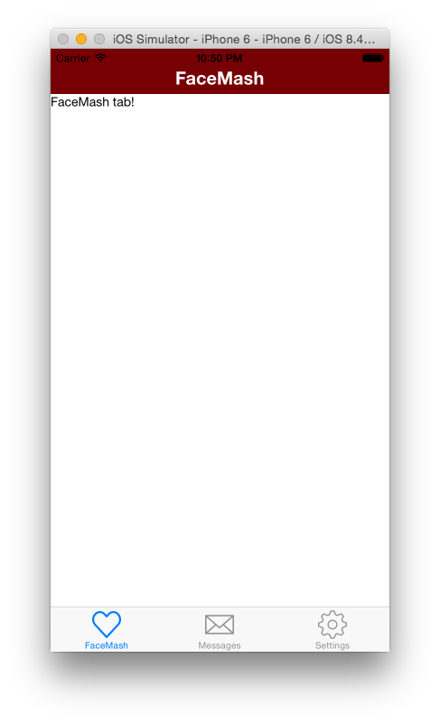

Now we're talking. However, this looks terrible as the status bar is black. Not to worry, we can change that using the `StatusBarIOS` API. When the `changeTab` function is called, we can check if the tab is the FaceMash tab. If it is, we'll set the status bar style to `1` (white), if not we'll set it to `0` (black).

```jsx
// omitted code

var {
  AppRegistry,
  StyleSheet,
  Text,
  View,
  TabBarIOS,
  StatusBarIOS
} = React;

var facemash = React.createClass({
  ...,
  changeTab(tabName) {
  StatusBarIOS.setStyle(tabName === 'faceMash' ? 1 : 0);
    this.setState({
      selectedTab: tabName
    });
  },
  ...
});

// omitted code
```

Refresh and you'll see a white status bar - sorted!

We can now get to hitting the endpoint and displaying our users. We'll be using <a href="https://github.com/github/fetch" target="_blank">fetch</a>, which is included for us in React Native by default.

```jsx
// omitted code

var facemashTab = React.createClass({
  getInitialState: function() {
    return {
      list: [],
      currentIndex: 0
    };
  },
  componentWillMount: function() {
    fetch('http://localhost:8882/rest/mash')
      .then(res => res.json())
      .then(res => this.setState({ list: res }));
  },
  render: function() {
    return (
      ...
    );
  }
});

// omitted code
```

The request will populate our state with the returned data. As the initial state is an empty array, we can check that in our `render` function and show the user a loading page whilst they wait.

```jsx
var {
  StyleSheet,
  Text,
  View,
  ActivityIndicatorIOS
  } = React;

var facemashTab = React.createClass({
  ...,
  render: function() {
    var contents;
    if (!this.state.list.length) {
      contents = (
        <View style={ styles.loading }>
          <Text style={ styles.loadingText }>Loading</Text>
          <ActivityIndicatorIOS />
        </View>
      )
    } else {
      contents = (
        <View style={ styles.content }>
          <Text>Loaded</Text>
        </View>
      )
    }

    return (
      <View style={ styles.container }>
        <View style={ styles.header }>
          <Text style={ styles.headerText }>FaceMash</Text>
        </View>
        { contents }
      </View>
    );
  }
});

var styles = StyleSheet.create({
  container: {
    flex: 1,
    backgroundColor: '#fff'
  },
  loading: {
    flex: 1,
    backgroundColor: '#fff',
    justifyContent: 'center',
    alignItems: 'center'
  },
  loadingText: {
    fontSize: 14,
    marginBottom: 20
  },
  header: {
    height: 50,
    backgroundColor: '#760004',
    paddingTop: 20,
    alignItems: 'center'
  },
  headerText: {
    color: '#fff',
    fontSize: 20,
    fontWeight: 'bold'
  }
});
```

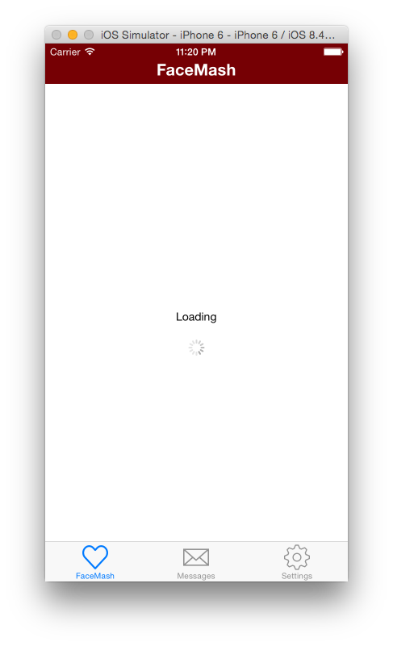 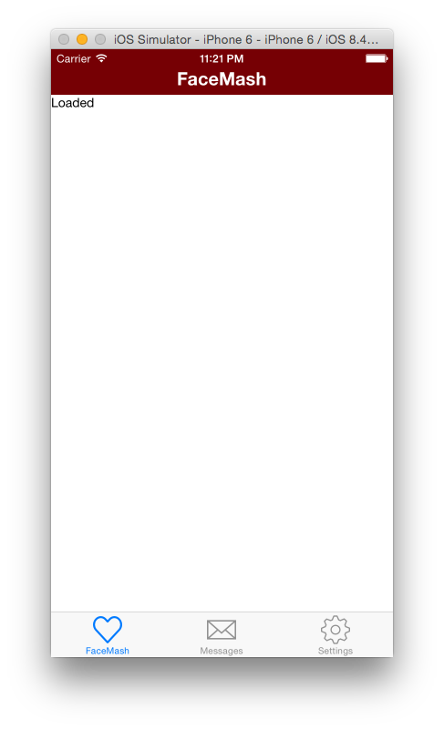

We will now have access to our data in `this.state.list`. We've also got what current index of that array we're at in the state as the endpoint returns an array of objects - each object being two people that the user can rate.

As there are two people to pick from, both of which have the same data associated with them, we're going to make a React component that will display their data.

```jsx
// omitted code

var Person = React.createClass({
  render: function() {
    var person = this.props.person;

    return (
      <View style={ styles.person }>
        <Text>Person!</Text>
      </View>
    )
  }
});

var facemashTab = React.createClass({
  getInitialState: function() {
    return {
      list: [],
      currentIndex: 0
    };
  },
  componentWillMount: function() {
    fetch('http://localhost:8882/rest/mash')
      .then(res => res.json())
      .then(res => this.setState({ list: res }));
  },
  render: function() {
    var contents;
    if (!this.state.list.length) {
      contents = (
        <View style={ styles.loading }>
          <Text style={ styles.loadingText }>Loading</Text>
          <ActivityIndicatorIOS />
        </View>
      )
    } else {
      var { list, currentIndex } = this.state;

      var record = list[currentIndex];

      var people = record.users.map(person => <Person person={ person } />);

      contents = (
        <View style={ styles.content }>
          { people }
        </View>
      )
    }

    return (
      <View style={ styles.container }>
        <View style={ styles.header }>
          <Text style={ styles.headerText }>FaceMash</Text>
        </View>
        { contents }
      </View>
    );
  }
});

var styles = StyleSheet.create({
  ...,
  person: {
    flex: 1,
    margin: 10,
    borderRadius: 3,
    overflow: 'hidden'
  }
});
```

We've now got a component that mounts twice (once for each person), and the appropriate configuration passed through to it. We can now display the profile picture and the relevant user info.

#### Displaying external images

Unlike our tab icons, the images we are displaying for each user come from an external source. This isn't a problem, in fact it's even easier to display them than displaying static assets.

Instead of passing a `require`'d image through to the Image component, we just pass through an object instead. This object will have one property - `uri`, which points to the image we want to load.

As we've passed through the user information as a property named `person`, we can access the image URL via `this.props.person.picture`.

```jsx
// omitted code

var Person = React.createClass({
  render: function() {
    var person = this.props.person;

    return (
      <View style={ styles.person }>
        <Image style={ styles.personImage } source={ { uri: person.picture } } />
      </View>
    )
  }
});

// omitted code

var styles = StyleSheet.create({
  ...
  person: {
    flex: 1,
    margin: 10,
    borderRadius: 3,
    overflow: 'hidden'
  },
  personImage: {
    flex: 1,
    height: 200
  },
  ...
});

module.exports = facemashTab;
```

There is also some styling needed - resizing images is incredibly easy. Similar CSS properties such as `background-size` can be applied to images in React Native, but we're just going to put a height on it, and the image will be resized accordingly.


We can now add the rest of the user information.

```jsx
// omitted code

var Person = React.createClass({
  render: function() {
    var person = this.props.person;

    return (
      <View style={ styles.person }>
        <Image style={ styles.personImage } source={ { uri: person.picture } } />
        <View style={ styles.personInfo }>
          <Text style={ styles.personName }>
            { person.firstName } { person.lastName }
          </Text>
          <View style={ styles.personScore }>
            <Text style={ styles.personScoreHeader }>
              WON
            </Text>
            <Text style={ [styles.personScoreValue, styles.won] }>
              { person.won }
            </Text>
          </View>
          <View style={ styles.personScore }>
            <Text style={ styles.personScoreHeader }>
              LOST
            </Text>
            <Text style={ [styles.personScoreValue, styles.lost] }>
              { person.lost }
            </Text>
          </View>
          <View style={ styles.personScore }>
            <Text style={ styles.personScoreHeader }>
              SCORE
            </Text>
            <Text style={ styles.personScoreValue }>
              { person.score }
            </Text>
          </View>
        </View>
      </View>
    )
  }
});

// omitted code

var styles = StyleSheet.create({
  ...,
  person: {
    flex: 1,
    margin: 10,
    borderRadius: 3,
    overflow: 'hidden'
  },
  personInfo: {
    borderLeftColor: 'rgba( 0, 0, 0, 0.1 )',
    borderLeftWidth: 1,
    borderRightColor: 'rgba( 0, 0, 0, 0.1 )',
    borderRightWidth: 1,
    borderBottomColor: 'rgba( 0, 0, 0, 0.1 )',
    borderBottomWidth: 1,
    padding: 10,
    alignItems: 'center',
    flexDirection: 'row'
  },
  personImage: {
    flex: 1,
    height: 200
  },
  personName: {
    fontSize: 18,
    flex: 1,
    paddingLeft: 5
  },
  personScore: {
    flex: 0.25,
    alignItems: 'center'
  },
  personScoreHeader: {
    color: 'rgba( 0, 0, 0, 0.3 )',
    fontSize: 10,
    fontWeight: 'bold'
  },
  personScoreValue: {
    color: 'rgba( 0, 0, 0, 0.6 )',
    fontSize: 16
  },
  won: {
    color: '#93C26D'
  },
  lost: {
    color: '#DD4B39'
  }
});

module.exports = facemashTab;
```


You can check out the code up to here on the `step-two` branch.

Now we've got the users displaying, we can add our tab events that allow the user to pick who is hottest.

#### Tap tap

React Native offers us the `TouchableHighlight` component. This allows our `View` components to respond properly to touches. When it is touched, the opacity of the wrapped view is decreased. This makes our components "feel" touchable.

We're going to wrap the person information section with this. In the future, we might want to make it so the user can tap the photo to see more pictures of that person.

```jsx
// omitted code

var Person = React.createClass({
  render: function() {
    var person = this.props.person;

    return (
      <View style={ styles.person }>
        <Image style={ styles.personImage } source={ { uri: person.picture } } />
        <TouchableHighlight>
          <View style={ styles.personInfo }>
            <Text style={ styles.personName }>
              { person.firstName } { person.lastName }
            </Text>
            <View style={ styles.personScore }>
              <Text style={ styles.personScoreHeader }>
                WON
              </Text>
              <Text style={ [styles.personScoreValue, styles.won] }>
                { person.won }
              </Text>
            </View>
            <View style={ styles.personScore }>
              <Text style={ styles.personScoreHeader }>
                LOST
              </Text>
              <Text style={ [styles.personScoreValue, styles.lost] }>
                { person.lost }
              </Text>
            </View>
            <View style={ styles.personScore }>
              <Text style={ styles.personScoreHeader }>
                SCORE
              </Text>
              <Text style={ styles.personScoreValue }>
                { person.score }
              </Text>
            </View>
          </View>
        </TouchableHighlight>
      </View>
    )
  }
});

// omitted code
```

If your reload our changes and tap on the user information, you'll notice it works - but it looks horrible. This is because we haven't set a background colour on the view, meaning the whole component is darkened.

```jsx
// omitted code

var styles = StyleSheet.create({
  ...,
  person: {
    flex: 1,
    margin: 10,
    borderRadius: 3,
    overflow: 'hidden'
  },
  personInfo: {
    backgroundColor: '#fff',
    borderLeftColor: 'rgba( 0, 0, 0, 0.1 )',
    borderLeftWidth: 1,
    borderRightColor: 'rgba( 0, 0, 0, 0.1 )',
    borderRightWidth: 1,
    borderBottomColor: 'rgba( 0, 0, 0, 0.1 )',
    borderBottomWidth: 1,
    padding: 10,
    alignItems: 'center',
    flexDirection: 'row'
  },
  ...
});

// omitted code
```

If you tap the info box now, it'll work correctly!

`TouchableHighlight` offers us the same events that `TouchableWithoutFeedback` has. `TouchableWithoutFeedback` shouldn't be used, as everything that can be tapped should provide some sort of visual feedback.

This means we can use `onPress` - which is called when the user has released the tap, but as long as it hasn't been interrupted (e.g. moving their finger off of the tappable area).

We need to pass a property down to our `Person` component for when it is tapped on.

```jsx
'use strict';

var React = require('react-native');
var {
  StyleSheet,
  Text,
  View,
  Image,
  ActivityIndicatorIOS,
  TouchableHighlight
  } = React;

var Person = React.createClass({
  render: function() {
    var person = this.props.person;

    return (
      <View style={ styles.person }>
        <Image style={ styles.personImage } source={ { uri: person.picture } } />
        <TouchableHighlight onPress={ this.props.onPress }>
          ...
        </TouchableHighlight>
      </View>
    )
  }
});

var facemashTab = React.createClass({
  ...,
  onPersonPress: function() {
    this.setState({
      currentIndex: this.state.currentIndex + 1
    });
  },
  ...,
  render: function() {
    var contents;
    if (!this.state.list.length) {
      contents = (
        <View style={ styles.loading }>
          <Text style={ styles.loadingText }>Loading</Text>
          <ActivityIndicatorIOS />
        </View>
      )
    } else {
      var { list, currentIndex } = this.state;

      var record = list[currentIndex];

      var people = record.users.map(person => <Person person={ person } onPress={ this.onPersonPress } />);

      contents = (
        <View style={ styles.content }>
          { people }
        </View>
      )
    }

    return (
      <View style={ styles.container }>
        <View style={ styles.header }>
          <Text style={ styles.headerText }>FaceMash</Text>
        </View>
        { contents }
      </View>
    );
  }
});

// omitted code
```

As you can see, there is now a `onPersonPress` property in our main tab component. We then pass this down to our `Person` components, and they then call it when the `TouchableHighlight` area has been tapped. We can then increment our index, and the view will rerender with the new set of people.


This is the final changes to the facemash tab. If you wish to go further with it, here are some ideas

* Hit a REST endpoint when a user has been picked
* Check if the end of the list has been reached, and display a message
* Allow the user to click on the photos and see more

You can check out the final code for our facemash tab on the `step-three` branch.

## Messages

We can now move onto the messages tab. This will function a bit like iMessage - a scrollable list of users, and clicking on one will navigate us to the chat view for that user.

Luckily, React Native gives us the `ListView` component. This allows us to have a simple, scrollable list (using `ScrollView`) as well as efficiently displaying the list (only re-renders changed rows and limits row rendering to one per event loop).

To use a `ListView`, we need to have a data source. A data source allows us to have a custom function to check whether or not a row has changed (think of it similar to `shouldComponentUpdate`) and we can then put our JSON data into it. The data source lives in our state object.

Create a new file in the `tabs/` folder called `Messages.js`.

```jsx
'use strict';

var React = require('react-native');
var {
  StyleSheet,
  Text,
  View,
  Image
  } = React;

var messagesTab = React.createClass({
  render: function() {
    return (
      <View style={ styles.container }>
        <Text>Messages!</Text>
      </View>
    );
  }
});

var styles = StyleSheet.create({
  container: {
    flex: 1,
    backgroundColor: '#fff'
  }
});

module.exports = messagesTab;
```

You'll also need to edit `index.ios.js` to point to the newly created component -

```jsx
// omitted code

var MessagesTab = require('./tabs/Messages');

var facemash = React.createClass({
  getInitialState() {
    return {
      selectedTab: 'faceMash'
    }
  },
  changeTab(tabName) {
    StatusBarIOS.setStyle(tabName === 'faceMash' ? 1 : 0);
    this.setState({
      selectedTab: tabName
    });
  },
  render: function() {
    return (
      <TabBarIOS>
        ...
        <TabBarIOS.Item
          title="Messages"
          icon={ require('image!messages') }
          onPress={ () => this.changeTab('messages') }
          selected={ this.state.selectedTab === 'messages' }>
          <MessagesTab />
        </TabBarIOS.Item>
        ...
      </TabBarIOS>
    );
  }
});

// omitted code
````

As I mentioned above, we need a data source for our list view. This is accessible via `ListView.DataSource`. We'll initialise one in our `getInitialState`.

```jsx
'use strict';

var React = require('react-native');
var {
  StyleSheet,
  Text,
  View,
  Image,
  ListView
  } = React;

var messagesTab = React.createClass({
  getInitialState: function() {
    return {
      dataSource: new ListView.DataSource({
        rowHasChanged: (r1, r2) => r1 !== r2
      })
    };
  },
  render: function(){
    return (
      <View style={ styles.container }>
        <Text>Messages!</Text>
      </View>
    );
  }
});

var styles = StyleSheet.create({
  container: {
    flex: 1,
    backgroundColor: '#fff'
  }
});

module.exports = messagesTab;
```

Now we've got our data source, we need to fetch some data from the server to know who we've been messaging. I've included in an endpoint configuration for stubby in the `step-three` branch.

```jsx
// omitted code

var messagesTab = React.createClass({
  componentWillMount: function() {
    fetch('http://localhost:8882/rest/messages')
      .then(res => res.json())
      .then(res => this.updateDataSource(res));
  },
  getInitialState: function() {
    return {
      dataSource: new ListView.DataSource({
        rowHasChanged: (r1, r2) => r1 !== r2
      })
    };
  },
  updateDataSource: function(data){
    this.setState({
      dataSource: this.state.dataSource.cloneWithRows(data)
    })
  },
  render: function(){
    return (
      <View style={ styles.container }>
        <Text>Messages!</Text>
      </View>
    );
  }
});

// omitted code
```

This will fetch our data and then update our data source with it. As this is all handled in the state, whenever our data source gets updated so will our view!

We can now move on to our `ListView` component. At a minimum, the component needs two properties - `dataSource` (which we already have) and `renderRow`. `renderRow` is a function that needs to return a React element. It's called once for every row in the data source, and is passed the appropriate data for that row as an argument.

```jsx
// omitted code

var messagesTab = React.createClass({
  ...,
  renderRow: function (){
    return (
      <View>
        <Text>Row goes here!</Text>
      </View>
    );
  },
  render: function(){
    return (
      <View style={ styles.container }>
        <ListView dataSource={ this.state.dataSource } renderRow={ this.renderRow } />
      </View>
    );
  }
});

// omitted code
```


We can now get to displaying the correct data for each row. The object for each item is passed through as the first parameter to our `renderRow` function.

```jsx
// omitted code

var messagesTab = React.createClass({
  ...,
  renderRow: function (person){
    return (
      <View>
        <Text>{ person.user.firstName } { person.user.lastName }</Text>
      </View>
    );
  },
  render: function(){
    return (
      <View style={ styles.container }>
        <ListView dataSource={ this.state.dataSource } renderRow={ this.renderRow } />
      </View>
    );
  }
});

// omitted code
```

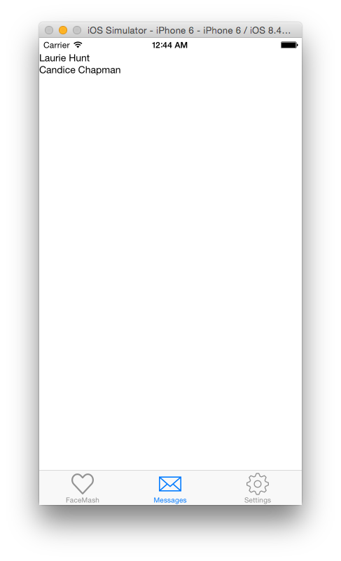

We can now go ahead and add the other information in there, such as the picture and the last received message.

```jsx
'use strict';

var React = require('react-native');
var {
  StyleSheet,
  Text,
  View,
  Image,
  ListView,
  PixelRatio
  } = React;

function prettyTime(timestamp) {
  var createdDate = new Date(timestamp);
  var distance = Math.round( ( +new Date() - timestamp ) / 60000 );

  var hours = ('0' + createdDate.getHours()).slice(-2);
  var minutes = ('0' + createdDate.getMinutes()).slice(-2);
  var month = ('0' + (createdDate.getMonth() + 1)).slice(-2);
  var date = ('0' + createdDate.getDate()).slice(-2);
  var year = createdDate.getFullYear();

  var string;
  if (distance < 1440) {
    string = [hours, minutes].join(':');
  } else if (distance < 2879) {
    string = 'Yesterday';
  } else {
    string = [date, month, year].join('/');
  }

  return string;
}

var messagesTab = React.createClass({
  ...,
  renderRow: function (person){
    var time = prettyTime(person.lastMessage.timestamp);
    return (
      <View>
        <View style={ styles.row }>
          <Image
            source={ { uri: person.user.picture } }
            style={ styles.cellImage }
            />
          <View style={ styles.textContainer }>
            <Text style={ styles.name } numberOfLines={ 1 }>
              { person.user.firstName } { person.user.lastName }
            </Text>
            <Text style={ styles.time } numberOfLines={ 1 }>
              { time }
            </Text>
            <Text style={ styles.lastMessage } numberOfLines={ 1 }>
              { person.lastMessage.contents }
            </Text>
          </View>
        </View>
        <View style={ styles.cellBorder } />
      </View>
    );
  },
  render: function(){
    return (
      <View style={ styles.container }>
        <ListView dataSource={ this.state.dataSource } renderRow={ this.renderRow } />
      </View>
    );
  }
});

var styles = StyleSheet.create({
  container: {
    flex: 1,
    backgroundColor: '#fff'
  },
  row: {
    flex: 1,
    alignItems: 'center',
    backgroundColor: 'white',
    flexDirection: 'row',
    padding: 10
  },
  textContainer: {
    flex: 1
  },
  cellImage: {
    height: 60,
    borderRadius: 30,
    marginRight: 10,
    width: 60
  },
  time: {
    position: 'absolute',
    top: 0,
    right: 0,
    fontSize: 12,
    color: '#cccccc'
  },
  name: {
    flex: 1,
    fontSize: 16,
    fontWeight: 'bold',
    marginBottom: 2
  },
  lastMessage: {
    color: '#999999',
    fontSize: 12
  },
  cellBorder: {
    backgroundColor: 'rgba(0, 0, 0, 0.1)',
    height: 1 / PixelRatio.get(),
    marginLeft: 4
  }
});

module.exports = messagesTab;
```

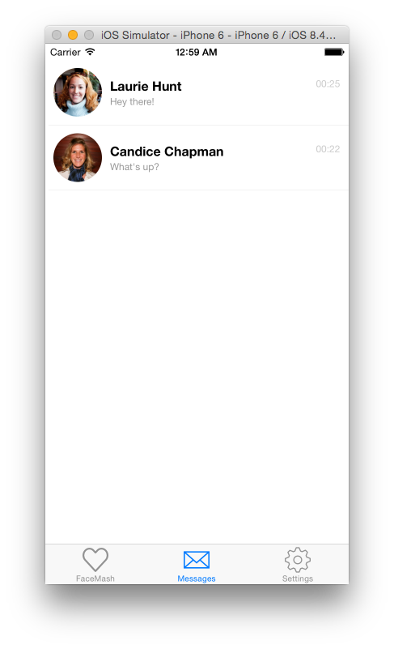

Looking good!

You'll notice in our stylesheet we're using something called `PixelRatio`. This is so we can get the thinnest line that can be possibly displayed on the device used. Normally, we would use 1px for the thinnest border, but there is no concept of px in React Native.

We can now add the code to deal with tapping on a user. We're going to make use of the `NavigatorIOS` component - you'll recognise it in apps such as iMessage and Notes. It allows us to have back-swipe functionality between views, as well as a navigation bar at the top.

We're actually going to make a new React component to house the navigator. This is because the component needs an initial React component to render.

We'll change our `messagesTab` component to be called `messageList`, and create another component called `messagesTab`

```jsx
'use strict';

var React = require('react-native');
var {
  StyleSheet,
  Text,
  View,
  Image,
  ListView,
  PixelRatio,
  NavigatorIOS
  } = React;

// omitted code

var messageList = React.createClass({
  ...,
  render: function(){
    return (
      <View style={ >
        <ListView dataSource={ this.state.dataSource } renderRow={ this.renderRow } />
      </View>
    );
  }
});

var messagesTab = React.createClass({
  render: function() {
    return (
      <NavigatorIOS
        style={ styles.container }
        initialRoute={
          {
            title: 'Messages',
            component: messageList
          }
        }
        />
    );
  }
});

// omitted code
```

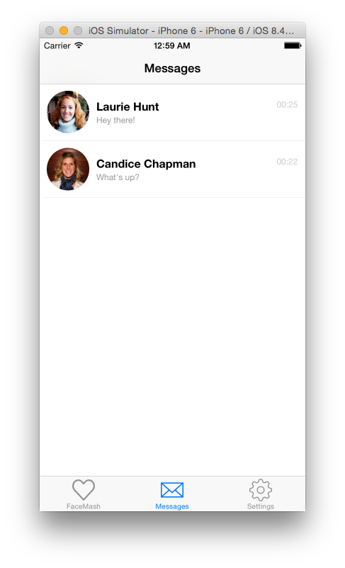

Looking much more professional already. Like we did in the facemash tab, we can now add `TouchableHighlight` to our rows.

```jsx
'use strict';

var React = require('react-native');
var {
  StyleSheet,
  Text,
  View,
  Image,
  ListView,
  PixelRatio,
  NavigatorIOS,
  TouchableHighlight
  } = React;

// omitted code

var messageList = React.createClass({
  componentWillMount: function() {
    fetch('http://localhost:8882/rest/messages')
      .then(res => res.json())
      .then(res => this.updateDataSource(res));
  },
  getInitialState: function() {
    return {
      dataSource: new ListView.DataSource({
        rowHasChanged: (r1, r2) => r1 !== r2
      })
    };
  },
  updateDataSource: function(data){
    this.setState({
      dataSource: this.state.dataSource.cloneWithRows(data)
    })
  },
  renderRow: function (person){
    var time = prettyTime(person.lastMessage.timestamp);
    return (
      <View>
        <TouchableHighlight>
          <View style={ styles.row }>
            <Image
              source={ { uri: person.user.picture } }
              style={ styles.cellImage }
              />
            <View style={ styles.textContainer }>
              <Text style={ styles.name } numberOfLines={ 1 }>
                { person.user.firstName } { person.user.lastName }
              </Text>
              <Text style={ styles.time } numberOfLines={ 1 }>
                { time }
              </Text>
              <Text style={ styles.lastMessage } numberOfLines={ 1 }>
                { person.lastMessage.contents }
              </Text>
            </View>
          </View>
          <View style={ styles.cellBorder } />
        </TouchableHighlight>
      </View>
    );
  },
  render: function(){
    return (
      <View style={ styles.container }>
        <ListView dataSource={ this.state.dataSource } renderRow={ this.renderRow } />
      </View>
    );
  }
});

// omitted code
```

Reload the changes and.. you'll get an error. This is because we are passing two child components through to `TouchableHighlight`, and it only plays nicely with one. Not to worry, we can just wrap the two components in another `View` component.

```jsx
// omitted code

var messageList = React.createClass({
  ...,
  renderRow: function (person){
    var time = prettyTime(person.lastMessage.timestamp);
    return (
      <View>
        <TouchableHighlight>
          <View>
            <View style={ styles.row }>
              <Image
                source={ { uri: person.user.picture } }
                style={ styles.cellImage }
                />
              <View style={ styles.textContainer }>
                <Text style={ styles.name } numberOfLines={ 1 }>
                  { person.user.firstName } { person.user.lastName }
                </Text>
                <Text style={ styles.time } numberOfLines={ 1 }>
                  { time }
                </Text>
                <Text style={ styles.lastMessage } numberOfLines={ 1 }>
                  { person.lastMessage.contents }
                </Text>
              </View>
            </View>
            <View style={ styles.cellBorder } />
          </View>
        </TouchableHighlight>
      </View>
    );
  },
  ...
});

// omitted code
```

Now, when we tap on the row, we get the expected behaviour. Wait a minute - our bottom border is now looking a bit weird! This is because we're using an `rgba` value. The background of the whole view is being changed, which means our border is then changed to be darker. Not to worry, we can give it a hex code instead.

```jsx
var styles = StyleSheet.create({
  ...,
  cellBorder: {
    backgroundColor: '#F2F2F2',
    height: 1 / PixelRatio.get(),
    marginLeft: 4
  }
});
```

You can see all the code up to this point on the `step-four` branch.

## Pushing and popping

Now we've got our main list styled, we can now handle the navigation change when the user is tapped.

`NavigatorIOS` allows us to "push" components into it when we want to change the current route. To do this, we need some way to access the `NavigatorIOS` instance in our child component, `messageList`. Luckily for us, this gets passed down as a prop named `navigator`.

Let's add an `onPress` event to our `TouchableHighlight` component.

```jsx
// omitted code

var messageList = React.createClass({
  ...,
  openChat: function (user){

  },
  renderRow: function (person){
    var time = prettyTime(person.lastMessage.timestamp);
    return (
      <View>
        <TouchableHighlight onPress={ this.openChat.bind(this, person.user) }>
          ...
        </TouchableHighlight>
      </View>
    );
  },
  ...
});

// omitted code
```

We now need a React component to pass through to our navigator. Create a new file called `MessageView.js` in our `tabs/` folder.

```jsx
'use strict';

var React = require('react-native');
var {
  StyleSheet,
  Text,
  View
  } = React;

var messageView = React.createClass({
  render: function(){
    return (
      <View style={ styles.container }>
        <Text>Message view!</Text>
      </View>
    );
  }
});

var styles = StyleSheet.create({
  container: {
    flex: 1,
    backgroundColor: '#fff'
  },
});

module.exports = messageView;
```

We can then include this in our `Messages.js` file, and push it through to the navigator.

```jsx
// omitted code

var messageList = React.createClass({
  ...,
  openChat: function (user){
    this.props.navigator.push({
      title: `${user.firstName} ${user.lastName}`,
      component: MessageView,
      passProps: { user }
    });
  },
  renderRow: function (person){
    var time = prettyTime(person.lastMessage.timestamp);
    return (
      <View>
        <TouchableHighlight onPress={ this.openChat.bind(this, person.user) }>
          <View>
            <View style={ styles.row }>
              <Image
                source={ { uri: person.user.picture } }
                style={ styles.cellImage }
                />
              <View style={ styles.textContainer }>
                <Text style={ styles.name } numberOfLines={ 1 }>
                  { person.user.firstName } { person.user.lastName }
                </Text>
                <Text style={ styles.time } numberOfLines={ 1 }>
                  { time }
                </Text>
                <Text style={ styles.lastMessage } numberOfLines={ 1 }>
                  { person.lastMessage.contents }
                </Text>
              </View>
            </View>
            <View style={ styles.cellBorder } />
          </View>
        </TouchableHighlight>
      </View>
    );
  },
  ...
});

// omitted code
```

You can see here we're pushing the next route into our navigator. From here we can set the next route's title (the user's first and last name), what component to render (our newly created MessageView) and what properties to pass through. This allows us to access anything we need in the `MessageView` component (we're going to pass through the user object).

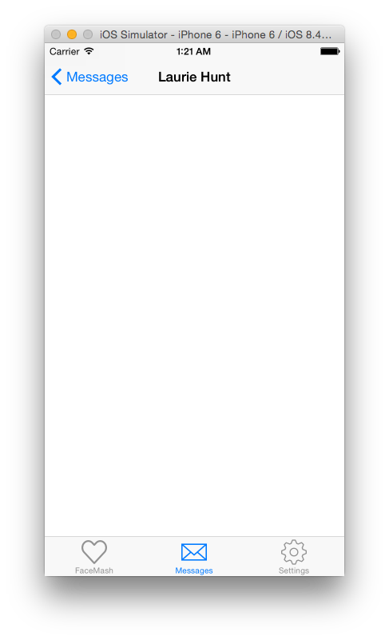

This will work for everyone in our chat list, no matter how big or small.

However, the text is being cut off by our new title bar. To solve this, we can just put some padding on our first `View` component.

Now we've got a `user` property being passed through, we can also display that!

```jsx
'use strict';

var React = require('react-native');
var {
  StyleSheet,
  Text,
  View
  } = React;

var messageView = React.createClass({
  render: function(){
    var user = this.props.user;
    return (
      <View style={ styles.container }>
        <Text>Chat with { user.firstName } { user.lastName }</Text>
      </View>
    );
  }
});

var styles = StyleSheet.create({
  container: {
    flex: 1,
    backgroundColor: '#fff',
    paddingTop: 64
  },
});

module.exports = messageView;
```

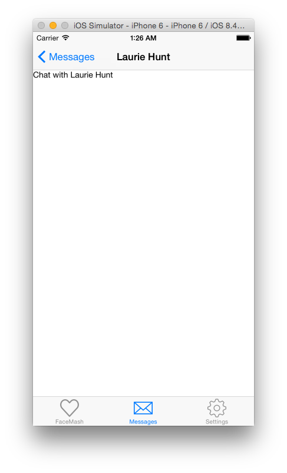

You can checkout the code up to here on the `step-five` branch.

If you wish to take this tab further, here are a few ideas

* Get the chat information for that user when `MessageView` mounts
* Try and implement pull down to refresh - hint: use the `renderHeader` property on `ListView`
* Add a "Settings" button to the right of the user's first/last name

## Conclusion

Feel free to try and add some functionality to the settings tab. Try and make use of other components, such as `DatePickerIOS` and `TextInput` for some common settings (DOB, name, etc).

Hopefully this has hit on quite a few different components that you will be commonly using in your React Native application. If you have any queries, feel free to contact me on twitter <a href="http://twitter.com/rynclark" target="_blank">@rynclark</a>.
